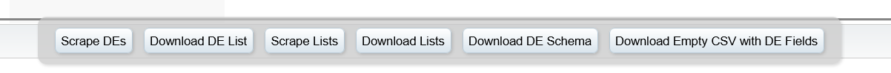

# What is this?
This toolset adds a few additional Data Extension related utilities to SFMC's Email Studio to help with some mundane tasks.

# How to use?

- Login to Marketing Cloud Engagement, go to Email Studio > Subscribers > Data Extensions
- Right click anywhere inside the "Data Extension" window (right-hand side, where the data extension list is displayed), then click "Inspect"
- Go to Console
- Paste the following script in the console and run
- This will add new buttons at the bottom of the page

```
var sfmcTools = document.createElement('script');
sfmcTools.src = 'https://cdn.jsdelivr.net/gh/mullasuleman/SFMC_Console_Toolset@main/sfmsToolSet.js';
document.head.appendChild(sfmcTools);
```

**FYI**
- If first-time pasting in console, type "allow pasting" and hit Enter. Otherwise you won't be able to paste into the console
- You can use `CTRL + SHIFT + C` (Windows) `CMD + SHIFT + C` (Mac) shortcut to quickly inspect any element in the current browser window

# Tools

These tools work with Data Extensions, Shared Data Extensions, Synchronized Data Extensions and Lists. These tools will stay visible until you close or leave Email Studio.



## Download Empty CSV
To download a blank csv with all DE fields as headers. 

- Open a data extension
- Click Download Empty CSV to download a blank CSV file with DE fields as headers

Sample CSV: [Sample_File_DE_Blank.csv](assets/Sample_File_DE_Blank.csv)

**Uses**
- Sometimes you really just want to quickly import some records. Use this to download a blank csv, populate with data and import.
- Use as a sample file for field mapping when setting up an import activity in Automation Studio
- Use as a sample file for field mapping when setting up an import definition in Contact Builder

This tool will also copy a comma-separated field list to the clipboard if you need to grab all fields from a data extension to use in SQL Query.

## Copy SQL
Copies an SQL query to your clipboard for the data extension that's currently open.

## Scrape and Download DEs
To scrape all the data extensions from the open folder. 
- Use Scrape DEs to scrape DEs from the current folder (it will scrape all pages inside the folder).
- Once you are done, click Download DE List button to download a CSV file with DEs you scraped

**Downloaded CSV includes:** DE Path, Name, External Key, Sendable, Field Count, Record Count, Last Modified Date

Sample CSV: [Sample_File_DE_List.csv](assets/Sample_File_DE_List.csv)

**FYI** 
- The download button will show how many DEs you have in your file
- Once you are done with a folder, you can change folder and repeat the steps to add DEs to your file before downloading.

## Scrape and Download Lists
To scrape all the lists from the open folder. Same functionality as DEs.

**Downloaded CSV includes:** List ID, Path, Name, External Key, Record Count

## Download DE Schema
To download schema of a data extension.
- Open a data extension
- Click Download DE Schema to download schema

**Downloaded CSV includes:** DE Path, Name, External Key, Fields, Field Type, Field Length, Primary Key, Nullable, and Default Value. 

Sample CSV: [Sample_File_DE_Schema.csv](assets/Sample_File_DE_Schema.csv)
